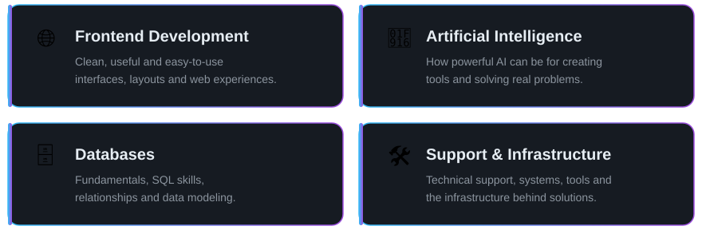

# 👋 Hi, I'm Jairo Herrera Romero

 

 

&nbsp;&nbsp;&nbsp;

&nbsp;&nbsp;&nbsp;

  

 

<h2 align="center" id="quick-navigation">📌 Quick Navigation</h2>

 

  

<h2 align="center" id="about-me">👨‍💻 About Me</h2>

I am an **Information Technology Engineering student at [Universidad Técnica Nacional (UTN), Costa Rica](https://www.utn.ac.cr/)**.

I am passionate about **technology, web development, artificial intelligence, and software creation**. 
I enjoy learning by building, exploring new tools, improving my logic, and growing step by step as a future IT professional.

 

 

  

<h2 align="center" id="my-journey">🚀 My Journey</h2>

Technology has always caught my attention, especially the **web development world**. 
During my learning process, I have worked with different programming languages, tools, frameworks, and databases that have helped me understand how software is built from different perspectives.

One of the areas I want to keep improving is **database fundamentals**, because databases are a key part of almost every real-world system.

I describe myself as a **constant and self-taught student**, someone who keeps learning even when something is difficult. 
My main personal values are **perseverance, consistency, and continuous improvement**.

 

 

  

<h2 align="center" id="tech-stack">🛠️ Tech Stack</h2>

SQL • Object-Oriented Programming • Responsive Design • Software Architecture • Database Design • ER Diagrams

  

Claude Code • Cursor • JetBrains IDEs • Apache NetBeans • Visual Studio • XAMPP

 

  

<h2 align="center" id="focus-areas">🎯 Focus Areas</h2>

 

  

<h2 align="center" id="currently-growing">📚 Currently Growing In</h2>

 

<b>🧩 More about my stack (click to expand)</b>

 

**Programming:** Java, Python, JavaScript, PHP, C#, SQL, Go and C++.

**Web & Frameworks:** HTML, CSS, React, Bootstrap, Django, Laravel, .NET and Spring Boot.

**Databases:** MySQL, SQLite, PostgreSQL, SQL Server, database design, entity-relationship diagrams and CRUD systems.

**Tools:** Git, GitHub, Claude Code, Cursor, Visual Studio, Visual Studio Code, JetBrains IDEs, Apache NetBeans, XAMPP, Docker, Postman and Figma.

**Areas of interest:** Web development, frontend development, artificial intelligence, databases, support, infrastructure, freelance work and company-based professional growth.

<b>🧭 Current status (click to expand)</b>

 

| Area | Status |
|---|---|
| Web Development | Main interest |
| Frontend | Strong personal preference |
| Artificial Intelligence | High interest |
| Databases | Improving fundamentals |
| Git & GitHub | Active use |
| Tools & IDEs | Constantly exploring |
| Professional Growth | Working toward company and freelance opportunities |

 

  

<h2 align="center" id="github-activity">📊 GitHub Activity</h2>

  

  

  

 

  

<h2 align="center" id="personal-side">🎵 Personal Side</h2>

  

  

### 🎧 Music

Music is part of my daily routine while studying, coding, and learning new things.

 

 

  

<h2 align="center" id="contact">📫 Contact</h2>

  

 

### ✨ Thanks for visiting my profile!

